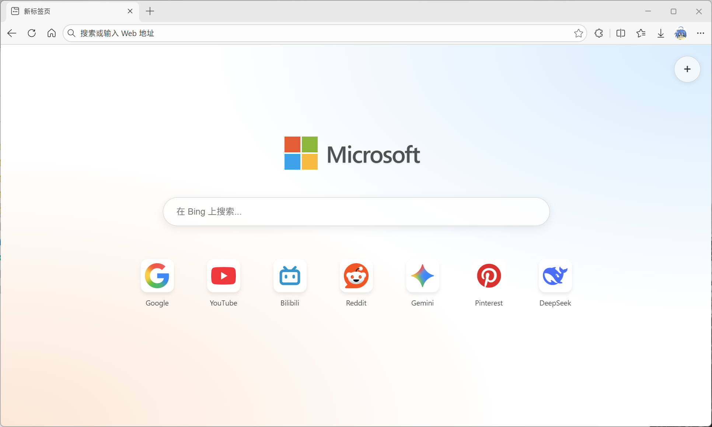
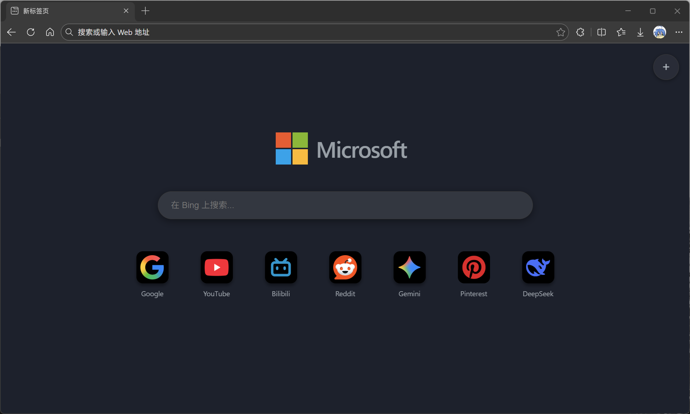

# openNewTab

An open new tab extension for Chrome Browser
一个开源的Chrome标签页，类似Firefox默认标签页或平板端的edge，个人自用

功能和实现都很简单，纯vibe coding产物，图标都是ai画的，无任何依赖项纯html/js/css实现，不知道为什么一直没人做，也找不到替代品

默认显示OpenTab图标，可手动配置

## Todo:
1.支持修改默认搜索引擎
2.支持选择图标底色和显示的大小
3.支持分别自定义深色和浅色模式下的壁纸
4.根据favicon自适应是否加边框
5.备份导出

## 待优化
1.点击时会误选中右上角加号

## 不考虑做的功能
1.账户登录
2.各种ai功能、小组件
3.读取浏览器收藏夹（懒得处理安全问题）
4.搜索引擎联想（懒得处理安全问题）
5.新闻页